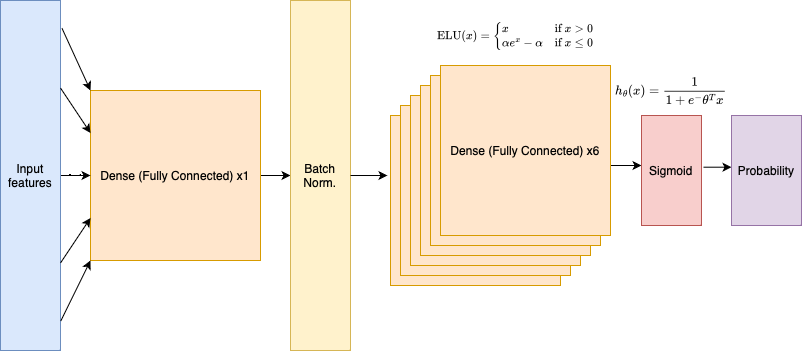

# Creating an Expected Goal Model for Singapore football


## Abstract

This research paper presents a comprehensive exploration and evaluation of a bespoke Expected Goal (xG) model specifically designed for Singaporean football. The study addresses data quality and quantity challenges by utilizing an extensive dataset comprising spatial and temporal information from two seasons of English Premier League matches. Varied machine learning techniques, including Logistic Regression, K-Nearest Neighbours, Linear and Non-Support Vector Classifiers, Decision Trees, and a custom Deep Neural Network, are employed to calibrate the probabilistic models. Through fine-tuning, an ensemble model is proposed, achieving outstanding accuracy exceeding the 90% threshold on the test set. This research expands the frontiers of xG modeling and machine learning in football, offering practical implications for performance analysis and decision-making within the sports domain. It provides precise xG prediction models tailored to Singaporean football and similar domains with limited data, presenting a cost-effective methodology to enhance performance analysis and contributing to the corpus of literature on machine learning in football.

[]()

## Acknowledgement

I would like to acknowledge the funding support from Nanyang Technological University – URECA Undergraduate Research Programme for this research project

I would like to extend my heartfelt gratitude to my supervisor - Asst. Prof Komar John fron Sports Science, National Institute of Education, Singapore.

## Code Repository Contents

1. `./assets` : This folder contains any additional assets, such as images, diagrams, or multimedia files, that are relevant to the research paper or the code repository.
2. `./docs` : This folder includes the documentation related to the code, such as the university-approved research paper and poster.
3. `./scripts` : The `scripts` folder houses auxiliary scripts, utilities based on different approaches used in the research process to facilitate the code's functionality. These scripts include data preprocessing, visualization, training, as well as verbose logging.
   1. `/machine-learning` : This subfolder contains scripts related to machine learning methodologies used in the research, such as Logistic Regression, K-Nearest Neighbours, Linear and Non-Support Vector Classifiers, and Decision Trees.
   2. `/deep-learning` : This subfolder contains scripts related to the custom Deep Neural Network used in the research.

## Gradio App for Inference

For testing purposes, a locally-hosted Gradio-based simple website was developed with the front-end consisting of simple input fields/blanks andback-end consisting of the efficient model.

To access the web-app, 

1. Make sure a `*.h5` file is stored within the same directory as the `gradio_app.py`. Ensure the name of the file within the line 28 is same as the one of the model file to load it successfully using Keras API.
2. Run the following command in the terminal/powershell from the root of the project directory:
   ```console
   $ python scripts/gradio_app.py
   ```

## Results and Discussion

Some of the ROC curves and TF model training curves generated using the training script are shown below:

![Model Los

## Conclusion

This research paper elucidates the development and evaluation of a bespoke Expected Goal (xG) model catered to the nuances of Singaporean football. By harnessing an exhaustive dataset from two seasons of English Premier League matches, the study overcomes data challenges and proposes an ensemble model with exemplary accuracy. The model's applications in the sports industry are extensive and impactful, enabling strategic decisions for coaches and analysts related to player positioning, attacking patterns, and defensive strategies. Furthermore, the study demonstrates the effectiveness of machine learning methodologies in handling data paucity, offering valuable insights for resource-constrained contexts in various sporting domains. The proposed methodology has the potential to revolutionize performance analysis and decision-making in sports, making valuable contributions to the field of machine learning in football and providing a solid foundation for future scholarly inquiries. A locally-hosted Gradio-based simple website was developed for testing purposes, presenting a user-friendly interface with efficient back-end model integration.
